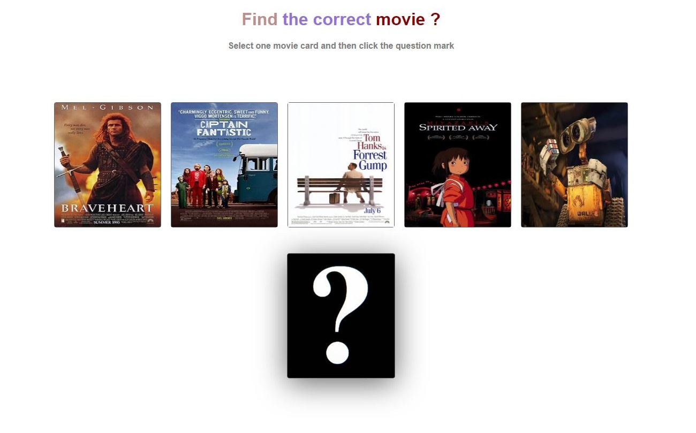

# Find-Movie-Game
This is a guess card game.




## Installation

1. Clone the repo
```bash
git clone https://github.com/akinankarali/Find-Movie-Game.git
```
2. Install NPM packages
```bash
npm install
```
3. Run app
```bash
npm run dev
```

## License
[MIT](https://choosealicense.com/licenses/mit/)
